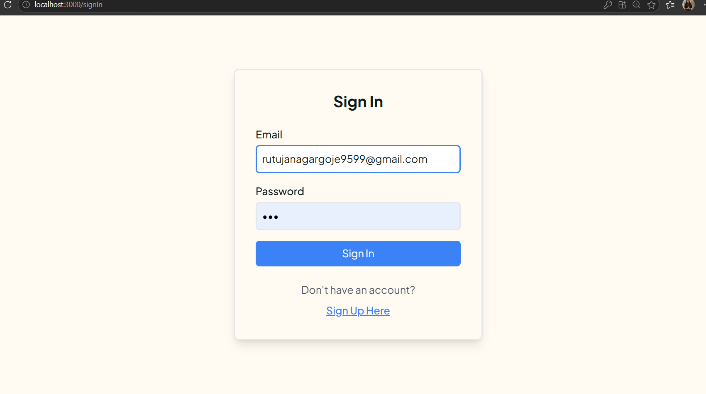
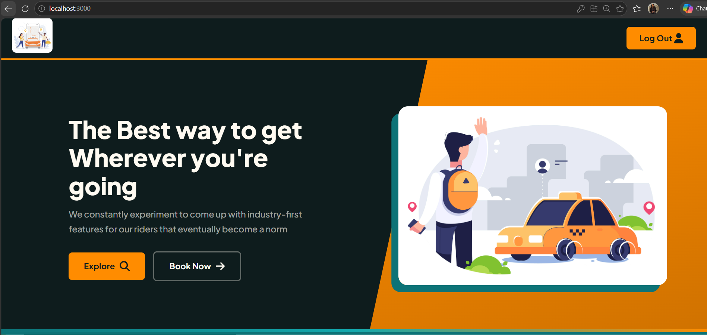
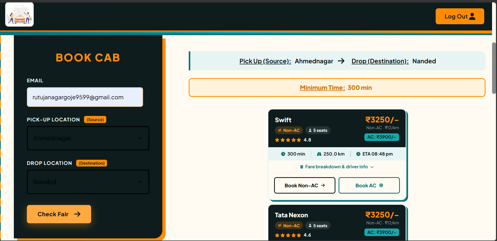
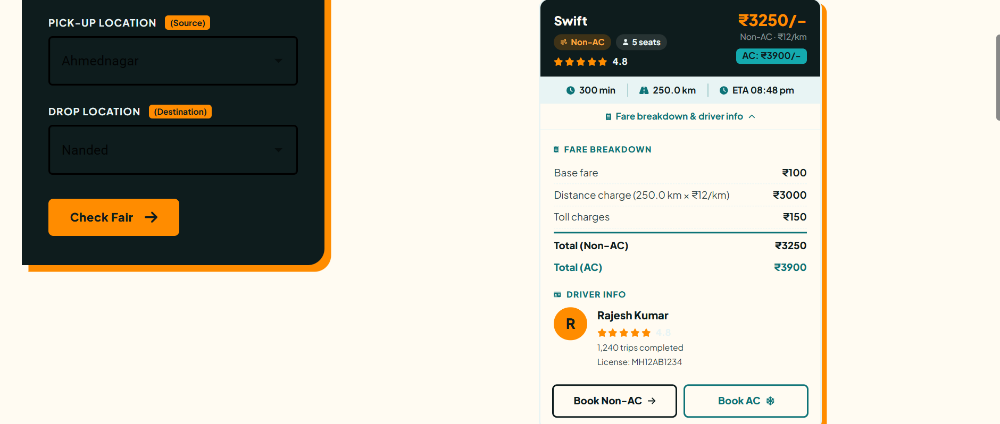
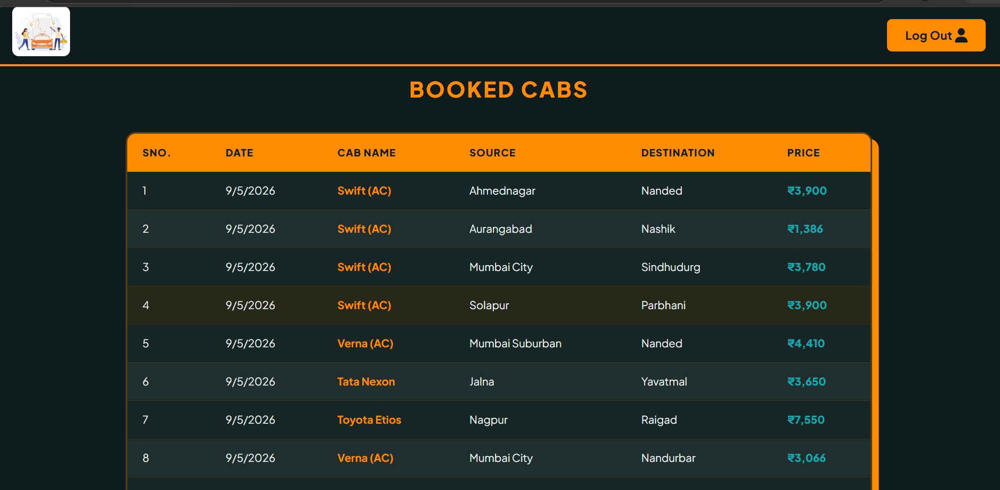

# 🚖 GoCab - Online Cab Booking System

<p>


</p>

Welcome to my project! This is a Cab Booking App made with MERN stack. It lets users quickly and easily book cabs with multiple options and price variations. With this App, users can effortlessly reach their destination in the minimum time and price.

dijkstra algorithm (Python) calculates the shortest path using the source and destination fetched from the user. Once the shortest path has been calculated, the website will display the estimated time and distance of the trip to the user, as well as the price calculated according to the formula 10rs/min(cab GO). Python file for the Shortest path is called using Child-process(NodeJs library)

The user gets notified through the Nodemailer email service used on the website, as soon as the user books the cab detailed mail is sent to the user about the price, timestamp of booking, cab name, etc. The driver would also receive the optimized route through their navigation system, ensuring they take the most efficient path to the destination.

No cab should have an overlapping start and end time - as the user booked a cab he/she cannot book another cab till the duration of the booked trip is completed. Responsive design web design users can use the web application on mobile devices also with the best user experience.

Admins can view all the user's email id, the number of cabs they have booked who booked cabs from the website, Admins can also view the total number of cabs that have been booked by all users its id, what time, email of the user, etc.

#### while ReactJs and NodeJs are structured using an atomic design model

---

## 👩‍💻 Developed By
**Rutuja Nagargoje**  
📧 rutujanagargoje875@gmail.com  
🔗 [GitHub Profile](https://github.com/rutujanagargoje875)

---

## 🚀 Features
- No Login Required — just the EMAIL
- Mail of confirmed booking is received
- Multiple cabs to choose from (Cab GO, Cab XL, Cab Premier, Auto, Rental)
- User can choose rate on his/her own will
- Multiple locations available
- Fare Calculation and Breakdown
- Admin Panel to view Users and Booked Cabs
- User friendly and Responsive UI


---

## clone or download
```terminal
$ cd frontend(ReactJs), cd backend(NodeJs)
$ yarn # or npm i
```

notice, you need client and server runs concurrently in different terminal session, in order to make them talk to each other

## Frontend usage(PORT: 3000)
```terminal
$ cd frontend        // go to frontend folder
$ yarn # or npm i    // npm install packages
$ npm start          // run it locally
```

## Backend usage(PORT: 5000)
```terminal
$ cd backend         // go to backend folder
$ npm i              // npm install packages
$ npm run devStart   // run it locally
```

### Setup Backend Environment
Add a `.env` file inside `backend/src/` with:
MONGODB_URL=your_mongodb_url
PORT=5000
GMAIL=your_gmail
PASS=your_gmail_password

---

## Dependencies(tech-stacks)

Client-side | Server-side
--- | ---
@emotion/react: ^11.10.6 | nodemailer: ^6.9.1
@emotion/styled: ^11.10.6 | body-parser: ^1.20.2
@fortawesome/fontawesome-free: ^6.4.0 | cors: ^2.8.5
react: ^18.2.0 | dotenv: ^16.0.3
react-dom: ^18.2.0 | express: ^4.18.2
react-router-dom: ^4.2.2 | mongoose: ^7.0.3
axios: ^1.3.5 | chalk: ^4.1.2
@mui/material ^5.12.1 |

---

## 📸 Screenshots

### Signin Page


### Home Page


### Book a Cab


### Fare Breakdown


### Booked Cabs


---

## Standard

[](https://github.com/standard/standard)

---

## BUGs or comments

[Create new Issues](https://github.com/rutujanagargoje875/GoCab-Online-Cab-Booking-System/issues) (preferred)

Email Me: rutujanagargoje875@gmail.com (welcome, say hi)